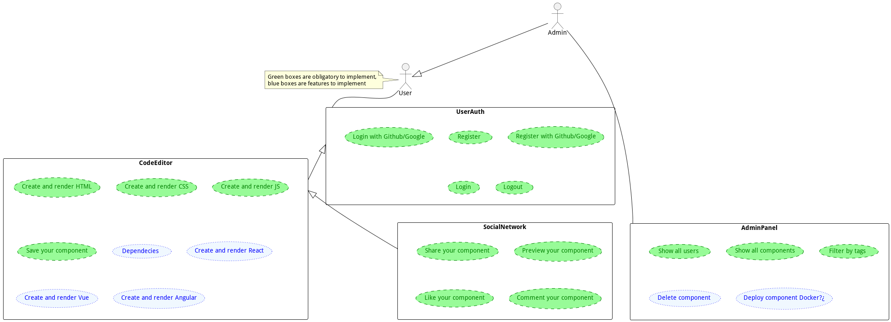
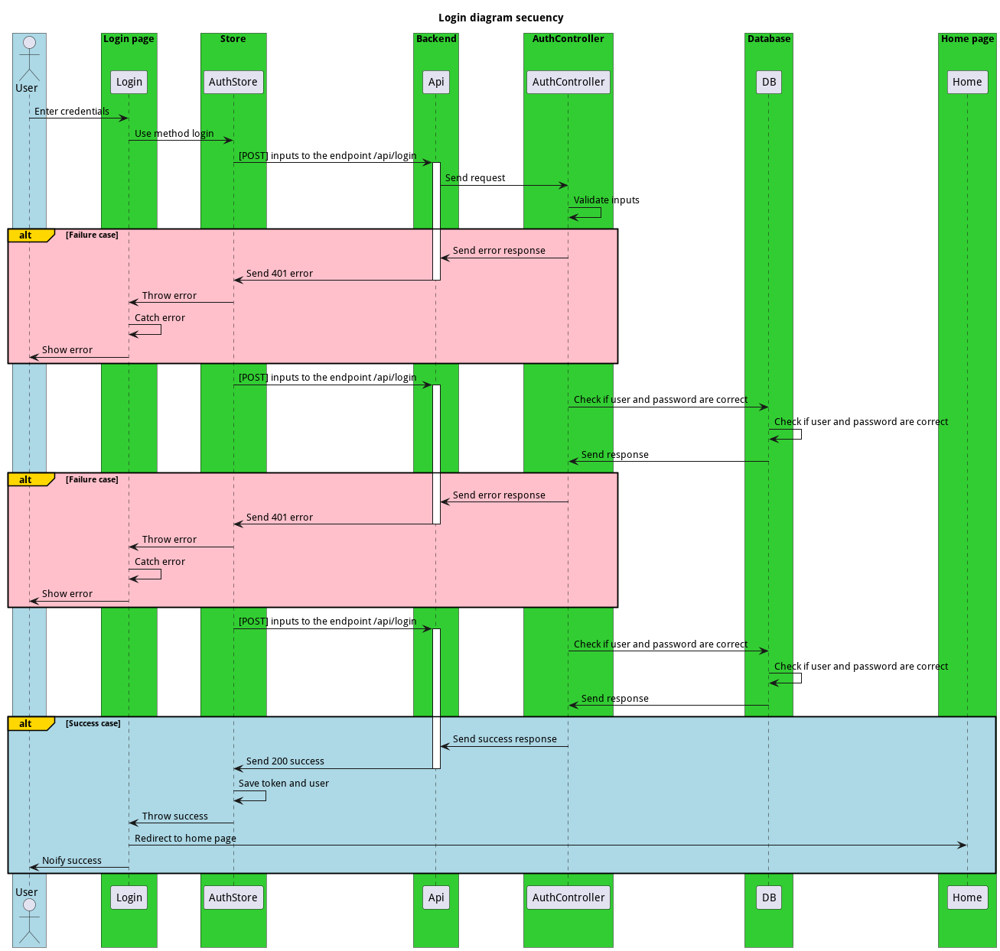
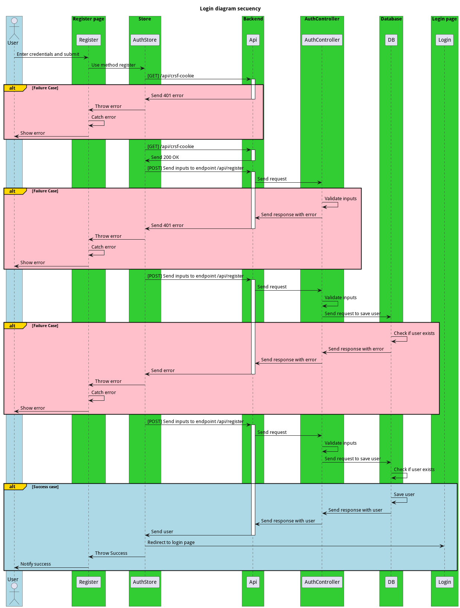
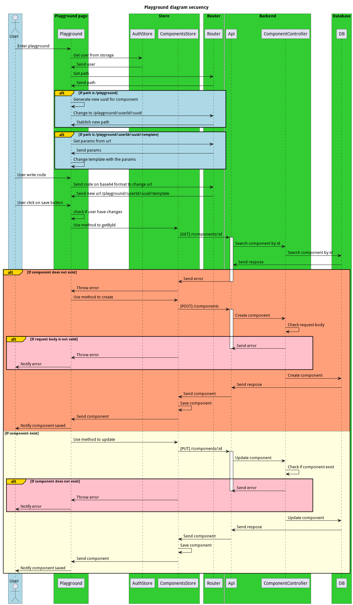
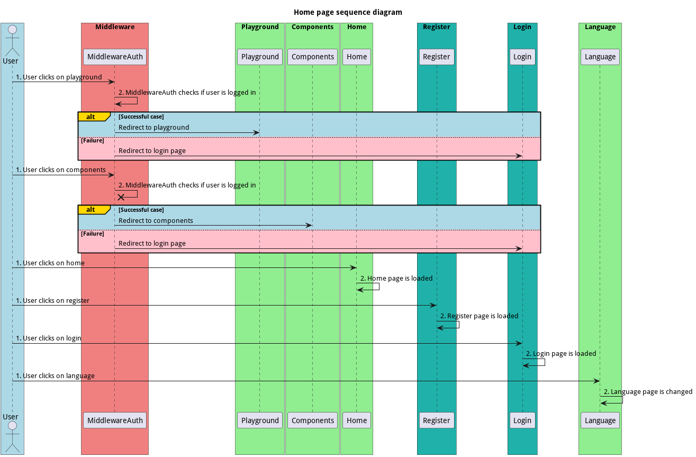

---

- [Idea](#idea)
  - [📋Feautures del proyecto](#feautures-del-proyecto)
- [🗃️Preparación del entorno y ejecución del proyecto](#️preparación-del-entorno-y-ejecución-del-proyecto)
  - [▶️Ejecutar el proyecto](#️ejecutar-el-proyecto)
  - [⚙️Compilar el proyecto](#️compilar-el-proyecto)
  - [▶️⚒️Ejecutar el proyecto compilado](#️️ejecutar-el-proyecto-compilado)
- [📚 Dependencias](#-dependencias)
  - [📒 Dependencias de desarrollo](#-dependencias-de-desarrollo)
  - [📕 Dependencias de producción](#-dependencias-de-producción)
- [📌Funcionalidades](#funcionalidades)
  - [🎨Login tradicional](#login-tradicional)
  - [🎨Registro tradicional](#registro-tradicional)
  - [🎨Editor de código](#editor-de-código)
  - [🎨Pagina de inicio](#pagina-de-inicio)
  - [🎨Dashboard de componentes](#dashboard-de-componentes)


# Idea

La idea principal es hacer una aplicación parecida a [Codepen](https://codepen.io/), obviamente no tan completa como esta, pero si con las funcionalidades básicas.

Partimos de la base de que tenemos un backend que nos proporciona los datos necesarios para poder obtener los **usuarios** y los **componentes** que estos han creado.

En un principio gestioné un diagrama de casos de usos para ver que podíamos llegar a hacer.



## 📋Feautures del proyecto

> **Nota:** Estas son las funcionalidades que tiene el proyecto en la versión 0.0.1, pero se irán cumpliendo y añadiendo más funcionalidades.

- [x] **Login tradicional**
- [x] **Registro tradicional**
- [x] **Logout**
- [x] **Editor de código**
- [x] **Guardar componentes**
- [x] **Editar componentes**
- [x] **Ver componentes**
- [x] **Publicar comentarios**
- [x] **Ver comentarios**
- [x] **Dar like a componentes**
- [ ] **Ver perfil de usuario**
- [ ] **Ver componentes de usuario**
- [ ] **Filtrar componentes**
- [ ] **Buscar componentes**
- [ ] **OAuth2**
- [ ] **Panel de administración**
- [ ] **Incluir dependencias en componentes**

# 🗃️Preparación del entorno y ejecución del proyecto

Para poder ejecutar el proyecto, necesitaremos tener instalado [Node.js](https://nodejs.org/es/). Una vez lo tengamos instalado, tendremos que instalar las dependencias del proyecto, para ello ejecutaremos el siguiente comando:

```bash
npm install
```

## ▶️Ejecutar el proyecto

Para ejecutar el proyecto, tendremos que ejecutar el siguiente comando:

```bash
npm run dev
```

## ⚙️Compilar el proyecto

Para compilar el proyecto, tendremos que ejecutar el siguiente comando:

```bash
npm run build
```

## ▶️⚒️Ejecutar el proyecto compilado

Para ejecutar el proyecto compilado, tendremos que ejecutar el siguiente comando:

```bash
npm run preview
```

# 📚 Dependencias

## 📒 Dependencias de desarrollo

- [@intlify/unplugin-vue-i18n](https://www.npmjs.com/package/@intlify/unplugin-vue-i18n): Un plugin para Vue.js que permite utilizar i18n con Vite.
- [@rushstack/eslint-patch](https://www.npmjs.com/package/@rushstack/eslint-patch): A patch for ESLint that improves performance with large projects.
- [@vitejs/plugin-vue](https://www.npmjs.com/package/@vitejs/plugin-vue): A plugin for integrating Vue.js with Vite.
- [@vue/eslint-config-prettier](https://www.npmjs.com/package/@vue/eslint-config-prettier): A configuration that disables ESLint rules that conflict with Prettier.
- [@vue/tsconfig](https://www.npmjs.com/package/@vue/tsconfig): A TypeScript configuration for Vue.js projects.
- [eslint](https://www.npmjs.com/package/eslint): A pluggable and configurable linter for JavaScript and TypeScript.
- [eslint-plugin-vue](https://www.npmjs.com/package/eslint-plugin-vue): A plugin for ESLint that provides linting rules for Vue.js.
- [node-sass](https://www.npmjs.com/package/node-sass): A library for transpiling SASS to CSS.
- [npm-run-all](https://www.npmjs.com/package/npm-run-all): A CLI tool for running multiple npm scripts in parallel or sequential order.
- [prettier](https://www.npmjs.com/package/prettier): An opinionated code formatter.
- [sass-reset](https://www.npmjs.com/package/sass-reset): A library for resetting browser default styles with SASS.
- [vite](https://www.npmjs.com/package/vite): A fast build tool and development server for modern web projects.

## 📕 Dependencias de producción

- [crypto-js](https://www.npmjs.com/package/crypto-js): Librería para cifrado de datos.
- [dotenv](https://www.npmjs.com/package/dotenv): Módulo que carga variables de entorno desde un archivo .env.
- [js-base64](https://www.npmjs.com/package/js-base64): Codificación y decodificación de Base64.
- [monaco-editor](https://www.npmjs.com/package/monaco-editor):  Editor de código web.
- [monaco-editor-vue3](https://www.npmjs.com/package/monaco-editor-vue3): Componente de Vue.js para el editor de código Monaco.
- [pinia](https://www.npmjs.com/package/pinia): Sistema de gestión del estado de la aplicación.
- [sweetalert2](https://www.npmjs.com/package/sweetalert2): Biblioteca de alertas.
- [toastify-js](https://www.npmjs.com/package/toastify-js): Biblioteca para mostrar notificaciones emergentes.
- [uuidv4](https://www.npmjs.com/package/uuidv4): Generador de identificadores únicos.
- [vue](https://www.npmjs.com/package/vue): Marco de trabajo de JavaScript para construir interfaces de usuario.
- [vue-i18n](https://www.npmjs.com/package/vue-i18n): Soporte internacionalización para aplicaciones Vue.js.
- [vue-router](https://www.npmjs.com/package/vue-router): Enrutador para aplicaciones Vue.js.
- [vue-skeletor](https://www.npmjs.com/package/vue-skeletor):  Componente Vue.js para cargar contenido de esqueleto.
- [vue3-split-panel](https://www.npmjs.com/package/vue3-split-panel): Componente Vue.js para panel de división.

# 📌Funcionalidades

## 🎨Login tradicional



## 🎨Registro tradicional



## 🎨Editor de código



## 🎨Pagina de inicio



## 🎨Dashboard de componentes


