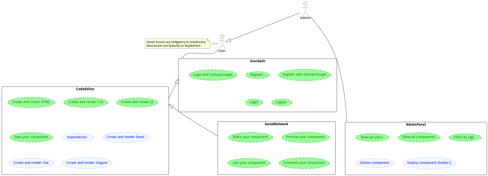

# Sketch

- Idea
- Tecnologías
- Librerías
- Estimaciones

## Idea

La idea principal es poner en práctica todo lo enseñado en el curso, para ello he pensado en hacer una aplicación parecida a [Codepen](https://codepen.io/), obviamente no tan completa como esta, pero si con las funcionalidades básicas.

En el caso de que no conozcas Codepen, es una aplicación web donde puedes crear pequeños proyectos web, con HTML, CSS y JavaScript, y puedes ver el resultado en tiempo real, también puedes compartir tus proyectos con otros usuarios, guardarlos, etc.

Mi idea es hacer una aplicación parecida, aunque si me da tiempo, le añadiré más funcionalidades, como son el poder crear proyectos con Angular, React, Vue, etc.

Aquí adjunto una imagen de mis funcionalidades, que son las que quiero implementar en mi aplicación.

 
## Tecnologías

Mi aplicación la voy a desarrollar en **Vue.js**, ya que es el framework que me siento mas cómodo, y también porque es el que más he utilizado en los proyectos que he hecho.

> **Nota:** Puede que use Nuxt.js, pero no se si lo voy a utilizar, ya que no he tenido tiempo de investigar y hasta que no lo empiece no se si voy a necesitarlo.

La parte de CSS, puede que me decante por **SASS** con una arquitectura **ITCSS**

También voy a utilizar una base de datos, aunque todavía no se cual, ya que no he tenido tiempo de investigar, pero al tener mi proyecto relaciones, veo bien una base de datos relacional como puede ser **MySQL**.
> **Nota:** Si tengo tiempo, ya que el proyecto es ambicioso, podría hacer refactoring y tener diferentes capas (Arquitectura)

Obviamente voy a utilizar **Git** para el control de versiones, y **GitHub** para alojar el repositorio.

Me gustaría trabajar con **CI/CD de Github**, aunque no se los limites que tengo trabajando en un repositorio de ClassRoom.

#### Resumen
- Vue.js o _(Nuxt.js)_
- SASS con ITCSS
- MySQL
- Git, GitHub, CI/CD de GitHub

> Son las técnologías que voy a utilizar, pero si veo que necesito alguna más, la añadiré.

## Librerías

He investigado un poco y he encontrado algunas librerías que me pueden ser de utilidad, y que voy a utilizar.

- [Monaco Editor](https://microsoft.github.io/monaco-editor/) - Editor de código
- [Skypack](https://www.skypack.dev/) - CDN para importar librerías de NPM
- [OAuth Github](https://docs.github.com/en/developers/apps/building-oauth-apps/authorizing-oauth-apps) - Autenticación con GitHub
- [OAuth Google](https://developers.google.com/identity/protocols/oauth2) - Autenticación con Google

